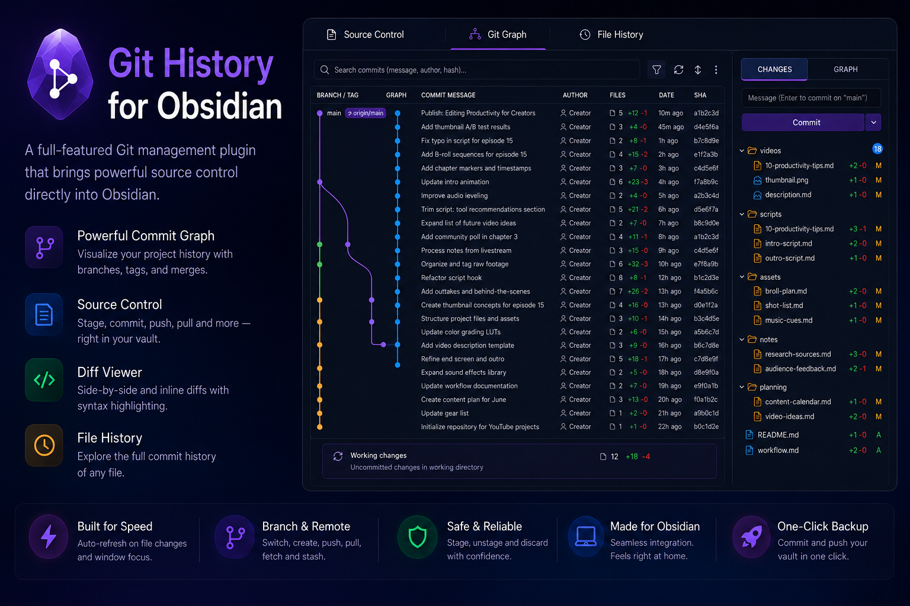
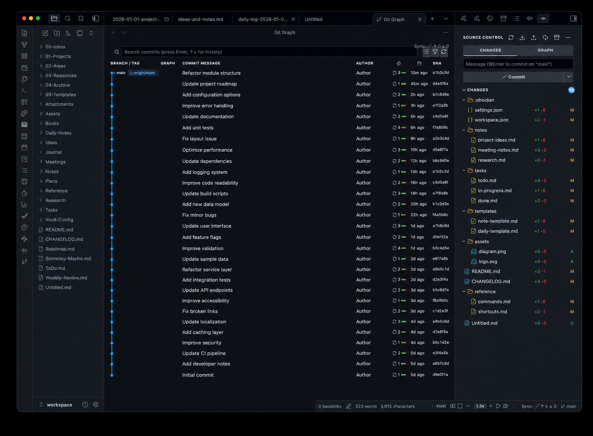

  <picture>
    <source media="(max-width: 600px)" srcset="docs/screenshots/hero-mobile.png" />
    
  </picture>

# 🌿 Git History for Obsidian

Version control for your vault, with an intuitive interface and no terminal
required.

Every note you edit is tracked. You can look back at what changed and when, undo
a change you regret, and keep a backup copy somewhere safe. The plugin shows all
of it as a visual timeline inside [Obsidian](https://obsidian.md) — point,
click, done.

---

## 🌱 New to Git? Start here

Git is a tool that remembers every version of every file. Three ideas cover
almost everything you will do:

| Term | What it means for your vault |
| --- | --- |
| 📸 **Commit** | A snapshot of your vault at one moment, with a short note about it. Like a save point you can return to. |
| ⬆️ **Push** | Uploads your snapshots to a backup copy, so they also exist off this computer. |
| ⬇️ **Pull** | Downloads snapshots you made elsewhere, for example on another computer. |

A typical day needs one habit: write what changed, press **Commit**, press
**Push**. Everything else in this plugin is there for the moment you want to
look back.

If your vault is not a Git repository yet, run the **Initialize Git repository**
command from Obsidian's command palette and the plugin sets one up for you.

---

## What you get

  

### 📋 Source control panel

Your changed notes, grouped and ready to commit.

- See at a glance which notes changed, and by how much
- Stage individual notes, whole folders, or everything at once
- Commit with a message, amend the last one, or commit and push in one step
- Pull, push, fetch and stash from the toolbar, with progress while they run
- Switch or create branches
- Refreshes itself when you edit notes or come back to the window

### 🌳 Commit graph

The history of your vault as a timeline.

- Every commit with its author, date, and how much changed
- Branches and merges drawn as coloured lanes
- Click a commit to expand it and see what it contained
- Search by message, author, or commit ID

A compact version lives in the sidebar, so you can glance at recent commits
without leaving what you were doing.

### 🕰️ File history

Pick any note and see only the commits that touched it — including the ones from
before you renamed it. Available from the command palette and from the
right-click menu in the source control panel.

### 🔍 Diff viewer

See exactly what changed in a note: old and new side by side, or as one
annotated text. You can stage or undo a single block of changes instead of the
whole file.

---

## 🧩 Requirements

- Obsidian 1.7.2 or later
- Git installed on your computer ([how to install](https://git-scm.com/downloads))
- Desktop only — Git cannot run on mobile

---

## ⌨️ Commands

Available from Obsidian's command palette (`Ctrl/Cmd + P`).

| Command | What it does |
| --- | --- |
| Open source control | Opens the sidebar panel |
| Open Git graph | Opens the full history timeline |
| Commit | Jumps to the panel to write a commit |
| Push | Uploads your commits |
| Pull | Downloads commits made elsewhere |
| Fetch | Checks for new commits without applying them |
| Backup: stage all, commit & push | Snapshots and uploads the whole vault in one step |
| Show file history | Shows the history of the note you have open |
| Initialize Git repository | Sets up version control for a vault that has none |

## ⚙️ Settings

| Setting | Default | What it does |
| --- | --- | --- |
| Commit message template | _(empty)_ | Message used by the one-step backup |
| Pull strategy | merge | How downloaded commits are combined with yours |
| Default diff view | side by side | Side by side, or one annotated text |
| Auto-fetch | off | Check for new commits in the background |
| Auto-fetch interval | 300s | How often to check |
| Show status bar | on | Branch and change count in Obsidian's status bar |
| Show nested repositories | off | List folders that are repositories of their own. They cannot be committed together with the rest of the vault |
| File watcher debounce | 1000ms | How long to wait after an edit before refreshing |

---

## 🔒 What the plugin does on your computer

Obsidian lists what a plugin is capable of, so here is what those capabilities
are used for:

- **Runs the `git` command.** That is how every action works — it is the same
  program you would use in a terminal, run inside your vault's folder only.
- **Writes to the clipboard.** Only when you use "Copy SHA" or "Copy path".

Nothing leaves your machine unless you press push, and then only to the backup
location you set up yourself.

---

## License

[MIT](LICENSE)
