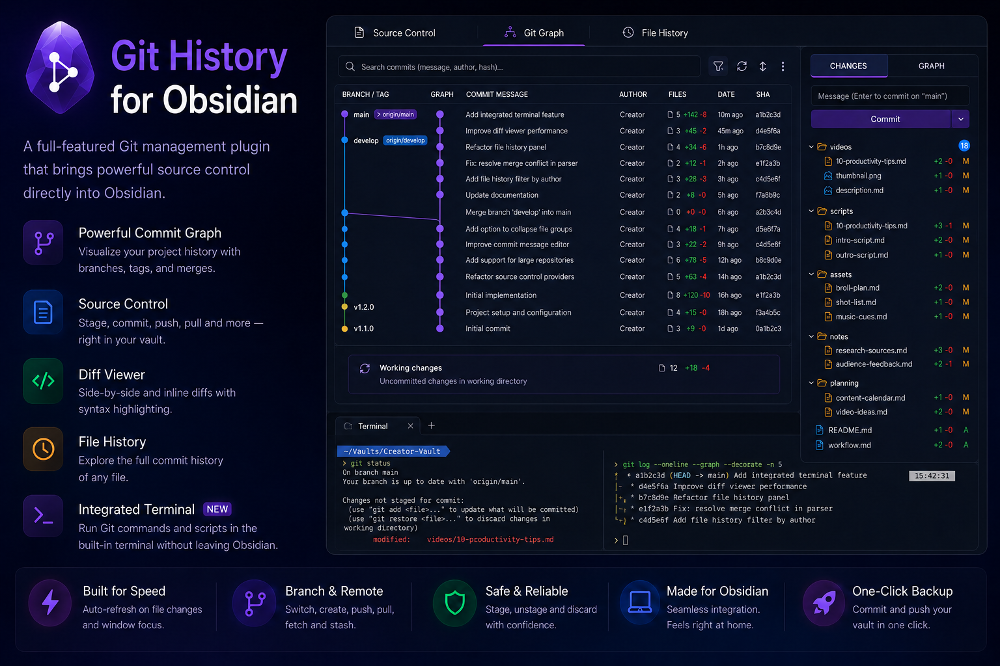
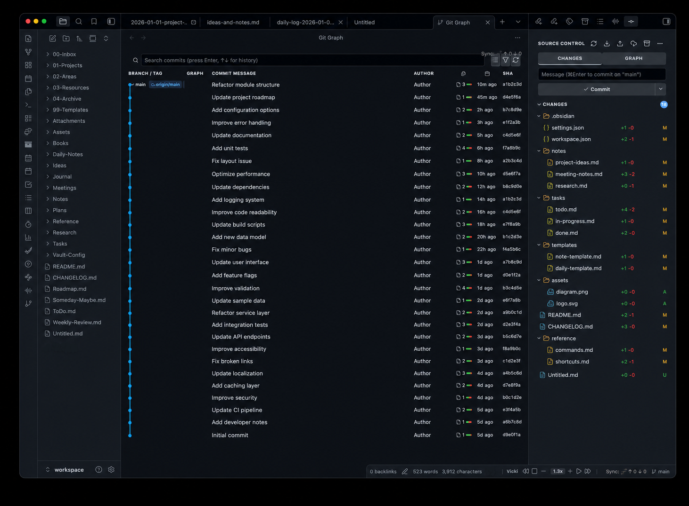
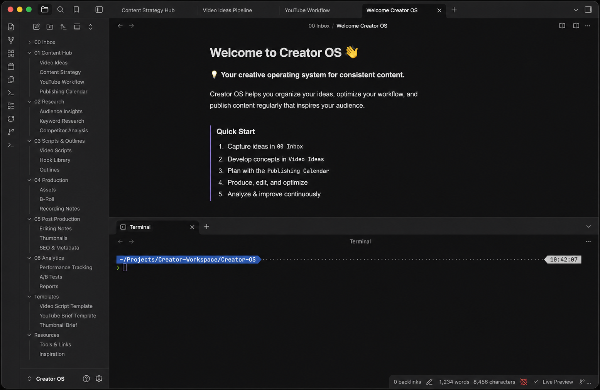

  <picture>
    <source media="(max-width: 600px)" srcset="docs/screenshots/hero-mobile.png" />
    
  </picture>

  

# 🌿 Git History for Obsidian

Version control for your vault, with an intuitive interface and no terminal
required.

Every note you edit is tracked. You can look back at what changed and when, undo
a change you regret, and keep a backup copy somewhere safe. The plugin shows all
of it as a visual timeline inside [Obsidian](https://obsidian.md) — point,
click, done.

---

## 🌱 New to Git? Start here

Git is a tool that remembers every version of every file. Three ideas cover
almost everything you will do:

| Term | What it means for your vault |
| --- | --- |
| 📸 **Commit** | A snapshot of your vault at one moment, with a short note about it. Like a save point you can return to. |
| ⬆️ **Push** | Uploads your snapshots to a backup copy, so they also exist off this computer. |
| ⬇️ **Pull** | Downloads snapshots you made elsewhere, for example on another computer. |

A typical day needs one habit: write what changed, press **Commit**, press
**Push**. Everything else in this plugin is there for the moment you want to
look back.

If your vault is not a Git repository yet, run the **Initialize Git repository**
command from Obsidian's command palette and the plugin sets one up for you.

---

## What you get

  

### 📋 Source control panel

Your changed notes, grouped and ready to commit.

- See at a glance which notes changed, and by how much
- Stage individual notes, whole folders, or everything at once
- Open or close a folder and everything under it in one click, at any depth
- Commit with a message, amend the last one, or commit and push in one step
- Pull, push, fetch and stash from the toolbar, with progress while they run
- Switch or create branches
- Refreshes itself when you edit notes or come back to the window

### 🌳 Commit graph

The history of your vault as a timeline.

- Every commit with its author, date, and how much changed
- Branches and merges drawn as coloured lanes
- Click a commit to expand it and see what it contained
- Read a commit's files as a folder tree or a flat list, with the same folding
  controls as the changes list
- Search by message, author, or commit ID

A compact version lives in the sidebar, so you can glance at recent commits
without leaving what you were doing.

### 🕰️ File history

Pick any note and see only the commits that touched it — including the ones from
before you renamed it. Available from the command palette and from the
right-click menu in the source control panel.

### 🔍 Diff viewer

See exactly what changed in a note: old and new side by side, or as one
annotated text. You can stage or undo a single block of changes instead of the
whole file.

### 💻 Terminal — Alpha

> **Alpha.** This one is early and I am still working on it. I am shipping it
> so you can try it — please
> [tell me what breaks](https://github.com/chrisurf/obsidian-git-history/issues).
> Expect rough edges, and do not rely on it for anything you cannot redo by
> hand.

A shell inside Obsidian, opened in a panel below your note, starting in your
vault's folder.

  

- Opens from the terminal ribbon icon, the commit graph toolbar, or the **Open
  terminal** command
- Starts in your vault's folder, so `git` and everything else act on your notes
- Uses your own login shell, with your prompt, colours, and aliases
- Resizes with the panel
- Several sessions side by side, listed as icons along the edge of the panel
- Give each session its own icon and colour from its right-click menu, so a row
  of identical shell icons stays readable. The icons are grouped by what the
  session is for — shells and pipelines, mail and meetings, documents and
  spreadsheets, presenting and recording, the business and the trip
- Drag the icons to reorder the sessions
- **Find in the terminal** with `Cmd/Ctrl+F`: a bar over the session with a
  match counter, Enter and Shift+Enter to step through the matches, toggles for
  match case and regular expressions, and Escape to get back to the shell.
  Anything selected in the terminal is what the search starts from
- A **startup script** in the settings is loaded into every session, in the
  place your own `.zshrc` would put it — aliases, environment variables and
  functions are there before the first prompt
- Desktop only, like the rest of the plugin

If a shell does not start, the panel says which program it tried to use and
what that program printed, with a **Try again** button next to it. The
**Check terminal setup** command reports the same thing at any time: which
search path is in use, which git and which interpreter were found, and what
the terminal can do with them.

---

## 🧩 Requirements

- Obsidian 1.7.2 or later
- Git installed on your computer ([how to install](https://git-scm.com/downloads))
- Desktop only — Git cannot run on mobile

---

## ⌨️ Commands

Available from Obsidian's command palette (`Ctrl/Cmd + P`).

| Command | What it does |
| --- | --- |
| Open source control | Opens the sidebar panel |
| Open Git graph | Opens the full history timeline |
| Commit | Jumps to the panel to write a commit |
| Push | Uploads your commits |
| Pull | Downloads commits made elsewhere |
| Fetch | Checks for new commits without applying them |
| Backup: stage all, commit & push | Snapshots and uploads the whole vault in one step |
| Show file history | Shows the history of the note you have open |
| Initialize Git repository | Sets up version control for a vault that has none |
| Set Git identity | Sets the name and email address Git puts on your commits |
| Open terminal | Opens the shell panel in your vault's folder (Alpha). `Cmd/Ctrl+J` |
| Find in terminal | Opens the find bar in the terminal you are in. `Cmd/Ctrl+F` while the terminal has focus |
| New terminal session | Starts another shell alongside the ones already running |
| Check terminal setup | Reports which programs the terminal found and what it can do with them |

Both shortcuts can be changed or cleared under **Settings → Hotkeys**. `Cmd/Ctrl+F`
is not a global binding: it belongs to the terminal while the terminal has the
focus, so the editor's own search is untouched everywhere else.

## ⚙️ Settings

### Identity

The name and email address Git records on every commit you make. These are not
plugin settings: they are read from `git config`, showing whichever value
applies here — your global one, or a value set for this vault, which overrides
it.

| Setting | What it does |
| --- | --- |
| Name | The name recorded as the author of your commits |
| Email | The address recorded alongside it, and what forges match commits to accounts by |

An edit is written **for this vault only**. Your global config is read, never
written: the name every other repository on your computer commits under is not
something a vault's settings should change.

Each row carries a badge saying where its value comes from — **This vault**,
**Global Git config**, or **Not set** — so an inherited value and one set for
these notes are never the same box with nothing to tell them apart. An
inherited one also says what an edit will do: give this vault its own value and
leave the original alone.

If neither is set anywhere, the plugin offers to set them when it loads, and
again if a commit fails for the lack of them. That prompt writes for this vault
too. Both are worth having: without
them, Git either refuses to commit or invents a name and an address from your
computer's user name and hostname — and puts those on your commits, where no
Git host can match them to your account.

### Remote repository

Where the vault is pushed to and pulled from: its copy on GitHub, GitLab or a
server of your own. Like the identity, this is not a plugin setting but what
`git remote` holds in this vault, and editing it runs git.

Every remote is one row: its name, which host it is on, and its address in a
field you can edit. Press **+** to add one — paste the address the host's clone
button gives you, and the name is filled in as `origin` for the first. An
address that is not one Git can use is refused with the reason, rather than
stored and failing at the first push.

### Commits and sync

| Setting | Default | What it does |
| --- | --- | --- |
| Commit message | _(empty)_ | Message used by the one-step backup. `{{date}}` becomes today's date |
| Pull strategy | merge | How downloaded commits are combined with yours |
| Auto-fetch | off | Check the remote for new commits in the background |
| Auto-fetch every | 300s | How often to check. Greyed out while auto-fetch is off |

### Changes and diffs

| Setting | Default | What it does |
| --- | --- | --- |
| Changes layout | tree | Files nested under their folders, or one flat row per file |
| Compact folders | on | Fold folders holding a single subfolder into one row. Tree layout only |
| Default diff view | side by side | Two columns side by side, or one annotated text |
| Only list files Obsidian can open | on | Leave files no Obsidian view can render out of a commit's file list |

### Advanced

| Setting | Default | What it does |
| --- | --- | --- |
| Show nested repositories | off | List folders that are repositories of their own. They cannot be committed together with the rest of the vault |
| Refresh delay | 1000ms | How long to wait after an edit before refreshing |
| Git binary | _(auto-detect)_ | Path to the git the plugin runs. Empty searches the PATH your own shell uses |

### Terminal

| Setting | Default | What it does |
| --- | --- | --- |
| Shell | _(auto-detect)_ | Path to the shell the Alpha terminal starts. Empty uses your system default |
| Python | _(auto-detect)_ | Path to the Python 3 behind the terminal's pseudo-terminal. Empty searches for one |
| Pseudo-terminal | Automatic | Which bridge gives the shell a real terminal. Automatic takes the first that works |
| Startup script | _(empty)_ | Shell code run at the start of every session, after your own rc files and before the first prompt |
| Colour new sessions | off | Hand every session you open the next free colour from the palette |

---

## 🔒 What the plugin does on your computer

Obsidian lists what a plugin is capable of, so here is what those capabilities
are used for:

- **Runs the `git` command.** That is how every action works — it is the same
  program you would use in a terminal, run inside your vault's folder only.
- **Writes to the clipboard.** Only when you use "Copy SHA" or "Copy path".
- **Starts a shell, if you open the Alpha terminal.** Only then, and only the
  shell you already use, started in your vault's folder. Whatever you type into
  that panel runs with your own user account, exactly as it would in Terminal
  or iTerm. Nothing runs there on its own.

Nothing leaves your machine unless you press push, and then only to the backup
location you set up yourself.

---

## License

[MIT](LICENSE)
